# Enterprise CDC Platform: End-to-End Architecture Specification

**Document Version:** 1.0.0  
**Classification:** Enterprise Platform Architecture  
**Author:** Principal CDC & Distributed Systems Architect  
**Runtime:** Apple Silicon M2 Mac Pro (16 GB Unified Memory), Podman Rootless, Python 3.12 + FastAPI Control Plane, Debezium 2.7+ & Apache Kafka (KRaft) Data Plane

---

## Table of Contents
1. [Executive Summary & Core Philosophy](#1-executive-summary--core-philosophy)
2. [C4 Architecture Models](#2-c4-architecture-models)
   - [2.1 Level 1: System Context Diagram](#21-level-1-system-context-diagram)
   - [2.2 Level 2: Container Diagram](#22-level-2-container-diagram)
   - [2.3 Level 3: Component Diagram (FastAPI & Debezium SMT Pipeline)](#23-level-3-component-diagram)
   - [2.4 Level 4: Deployment Diagram (Podman Rootless on M2 ARM64)](#24-level-4-deployment-diagram)
3. [Heterogeneous Database CDC Engine Flows](#3-heterogeneous-database-cdc-engine-flows)
   - [3.1 PostgreSQL (WAL / pgoutput / LSN)](#31-postgresql-cdc-data-flow)
   - [3.2 MySQL (Binary Log / GTID)](#32-mysql-cdc-data-flow)
   - [3.3 Oracle (Redo Log / LogMiner / SCN)](#33-oracle-cdc-data-flow)
   - [3.4 SQL Server (Change Data Capture / LSN)](#34-sql-server-cdc-data-flow)
   - [3.5 MongoDB (Replica Set Change Streams / Resume Tokens)](#35-mongodb-cdc-data-flow)
4. [Incremental Snapshot Architecture (DBlog Algorithm)](#4-incremental-snapshot-architecture-dblog-algorithm)
5. [Kafka Topic Strategy & Schema Governance](#5-kafka-topic-strategy--schema-governance)
6. [Canonical Event Contract](#6-canonical-event-contract)
7. [Failure Recovery & Resiliency Flows](#7-failure-recovery--resiliency-flows)
8. [Security & RBAC Architecture](#8-security--rbac-architecture)
9. [Non-Functional Requirements (NFR) Matrix](#9-non-functional-requirements-nfr-matrix)

---

## 1. Executive Summary & Core Philosophy

The **Enterprise CDC Platform** is an event-driven data capture platform engineered to decouple heterogeneous database mutations from operational queries, streaming transaction logs with sub-second latency into Apache Kafka.

```
┌────────────────────────────────────────────────────────────────────────┐
│               CDC CONTROL PLANE (Python 3.12 + FastAPI)                │
│  • Prerequisite Discovery • Health & Lag Monitoring • Schema Governance│
│  • Incremental Snapshot Triggers • RBAC & Multi-Tenant Quotas • Audit  │
└───────────────────────────────────┬────────────────────────────────────┘
                                    │ Declarative REST / Config Sync
                                    ▼
┌──────────────────┐      ┌──────────────────────────────────────────────┐
│ Heterogeneous DB │      │     CDC DATA PLANE (Debezium + Kafka Connect) │
│ Sources:         ├─────►│  Log Mining: pgoutput / binlog / redo log     │
│ PG, MySQL, ORA,  │(WAL) │  SMT Masking • Wire-Format Avro Serialization │
│ MSSQL, MongoDB   │      │  At-Least-Once Offset Checkpoint Guarantee   │
└──────────────────┘      └──────────────────────┬───────────────────────┘
                                                 │ Idempotent Producer
                                                 ▼
                          ┌──────────────────────────────────────────────┐
                          │   APACHE KAFKA CLUSTER (KRaft Consensus)     │
                          │  Compacted Topics • Confluent Schema Registry │
                          └──────────────────────┬───────────────────────┘
                                                 │ Sub-Second Streaming
                                                 ▼
                               [ Data Lake / Microservices / Elastic / DWH ]
```

### Core Tenets
1. **Zero Log Parser Reinvention:** Low-level transaction log decoding (PostgreSQL WAL, MySQL binlog, Oracle redo, SQL Server transaction log, MongoDB oplog) is delegated entirely to **Debezium on Kafka Connect**.
2. **Strict Plane Separation:** The **Control Plane** (Python 3.12 + FastAPI + AsyncPG) is completely isolated from high-volume data payloads. It handles registration, prerequisite verification, schema policies, ad-hoc snapshot signaling, and health telemetry.
3. **M2 Mac Pro 16 GB Memory Optimization:** All services run within **Podman rootless containers** strictly budgeted to stay under **11.5 GB of Unified Memory**, allowing zero-paging execution alongside macOS host workloads.
4. **End-to-End Pipeline Transparency:** Full tracing across all 4 stages: Source Database $\rightarrow$ Debezium SMT Engine $\rightarrow$ Kafka KRaft Broker $\rightarrow$ Downstream Consumers.
5. **SOLID Principles & Modular Architecture:** Strict adherence across both control plane microservices and data pipelines:
   - **S (Single Responsibility):** Domain models represent entities only; SMT transforms handle PII/diffing; Routers handle HTTP contracts only.
   - **O (Open/Closed):** Extensible `IConnectorStrategy` registry allows adding new engines (e.g. Cassandra, TiDB) without modifying existing strategies.
   - **L (Liskov Substitution):** All database connector strategies implement `IConnectorStrategy` and can be substituted transparently into the Kafka Connect provisioning registry.
   - **I (Interface Segregation):** Fine-grained interfaces (`IPrerequisiteChecker`, `IConnectorManager`, `ISnapshotCoordinator`, `ISMTTransformer`, `ISchemaRegistryValidator`, `IMetricsProvider`).
   - **D (Dependency Inversion):** FastAPI routers depend strictly on abstract protocols injected via `backend/app/api/dependencies.py`.

### 1.1 The 4-Stage Transparent Event Pipeline

```text
┌─────────────────────────┐      ┌─────────────────────────┐      ┌─────────────────────────┐      ┌─────────────────────────┐
│ STAGE 1: SOURCE DB      │      │ STAGE 2: DEBEZIUM       │      │ STAGE 3: KAFKA KRAFT    │      │ STAGE 4: DOWNSTREAM     │
│                         │      │                         │      │                         │      │                         │
│ • Executed SQL/Mutation ├─────►│ • Raw Log Segment Read  ├─────►│ • Destination Topic     ├─────►│ • Snowflake / DWH Sync  │
│ • Commit Tx ID & Time   │(WAL) │ • SMT Masking (PII)     │(Net) │ • Partition & Offset    │(Sub) │ • Microservices ACK     │
│ • LSN / GTID / SCN Pos  │      │ • Schema Registry Check │      │ • Idempotent Producer   │      │ • Search Indexer ACK    │
│ • Pre- vs Post-Tuple    │      │ • Canonical Wire Header │      │ • Log Compaction Key    │      │ • E2E Latency Tracking  │
└─────────────────────────┘      └─────────────────────────┘      └─────────────────────────┘      └─────────────────────────┘
```

---

## 2. C4 Architecture Models

### 2.1 Level 1: System Context Diagram

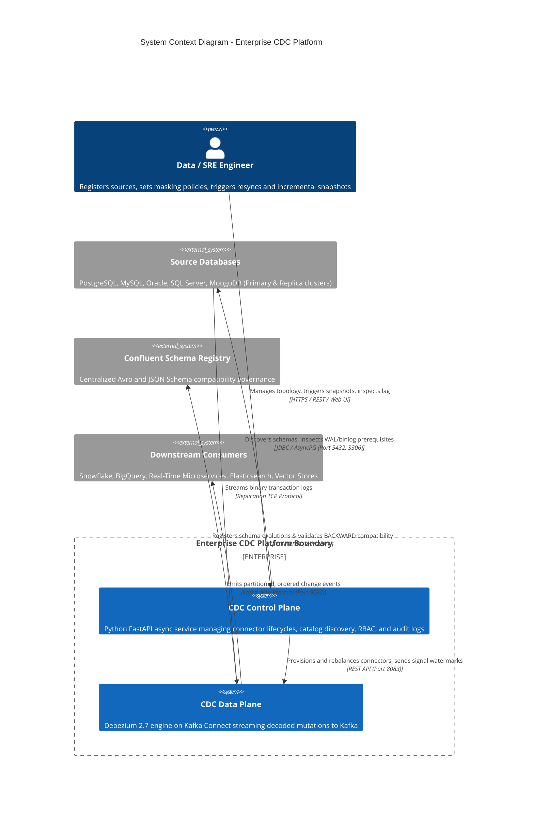

---

### 2.2 Level 2: Container Diagram

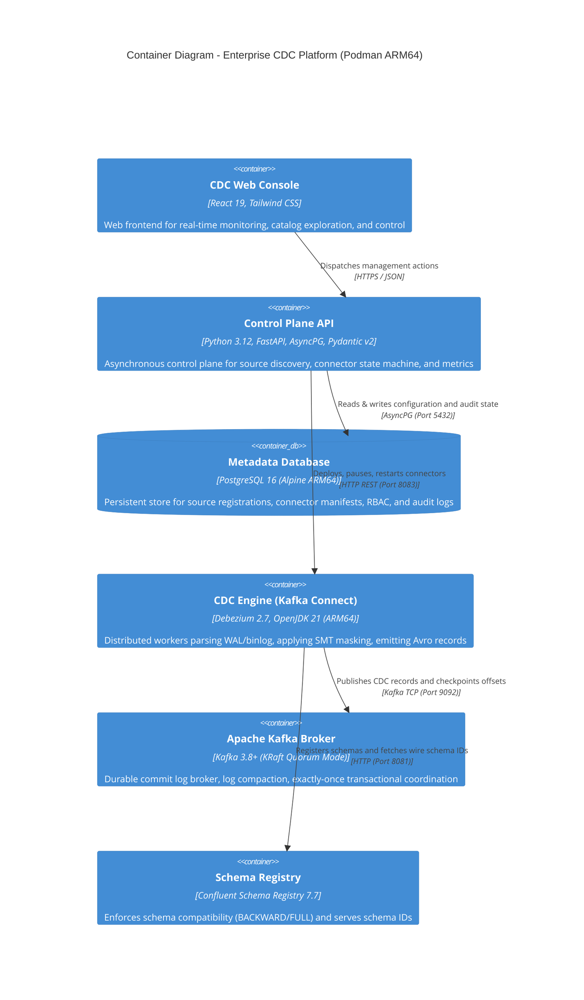

---

### 2.3 Level 3: Component Diagram

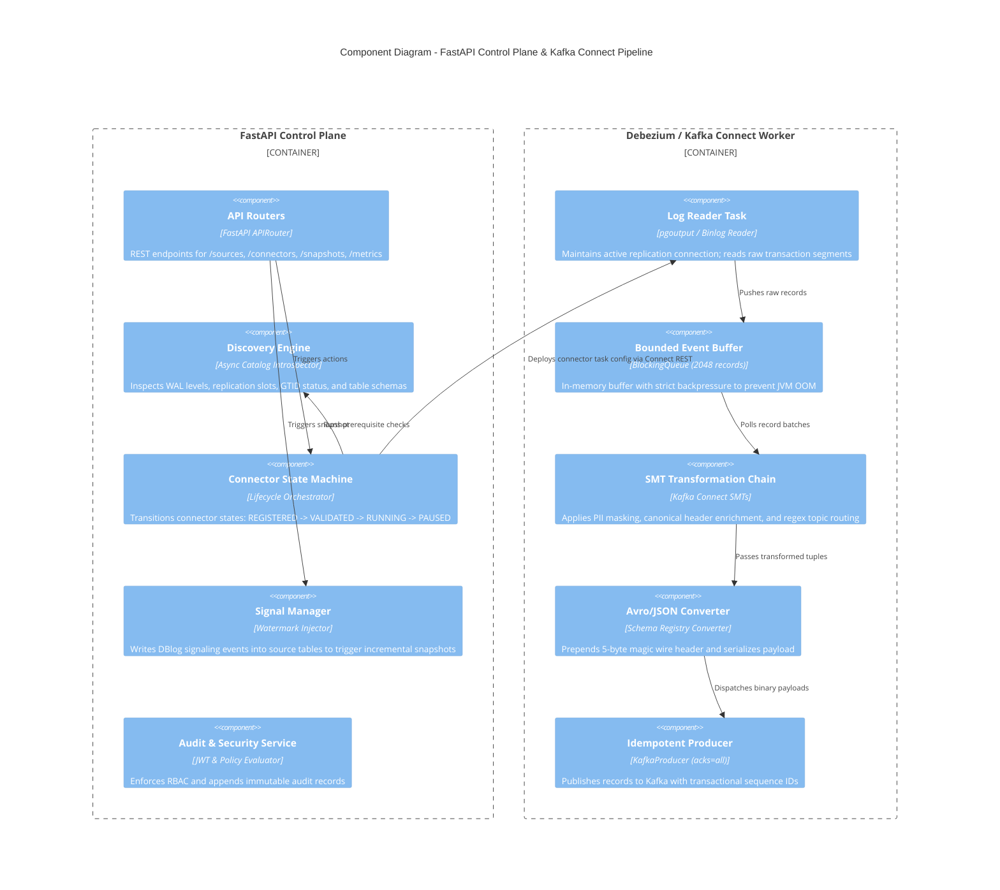

---

### 2.4 Level 4: Deployment Diagram (Podman Rootless on macOS M2)

```mermaid
deployment
    title Deployment Diagram - Apple Silicon M2 (16 GB Unified Memory)

    deploymentNode(m2_host, "macOS Host: Apple Silicon M2 (16 GB RAM)", "Physical Machine") {
        deploymentNode(podman_vm, "Podman QEMU/Hypervisor Machine (11.5 GB RAM Cap)", "Virtual Machine") {
            deploymentNode(bridge_net, "Isolated Podman Network: cdc-enterprise-net", "Container Bridge") {
                node(c_fastapi, "cdc-control-plane", "Python 3.12 (Mem: 300MB)")
                node(c_meta_db, "cdc-metadata-db", "PostgreSQL 16 (Mem: 700MB)")
                node(c_connect, "cdc-debezium-connect", "OpenJDK 21 (Mem: 2400MB)")
                node(c_kafka, "cdc-kafka-broker", "KRaft Broker (Mem: 1800MB)")
                node(c_schema, "cdc-schema-registry", "Schema Registry (Mem: 600MB)")
                node(c_pg_src, "cdc-postgres-source", "Postgres 16 WAL (Mem: 1400MB)")
                node(c_my_src, "cdc-mysql-source", "MySQL 8.4 GTID (Mem: 1400MB)")
                node(c_mg_src, "cdc-mongo-source", "MongoDB 7.0 RS (Mem: 1000MB)")
            }
        }
        node(host_tools, "macOS User Space", "Free RAM: ~4.5 GB (Zero Paging)")
    }
```

---

## 3. Heterogeneous Database CDC Engine Flows

### 3.1 PostgreSQL CDC Data Flow

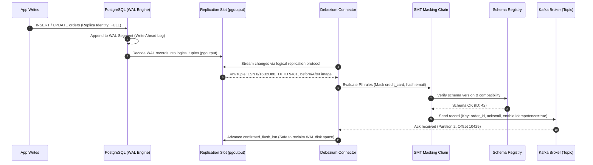

---

### 3.2 MySQL CDC Data Flow

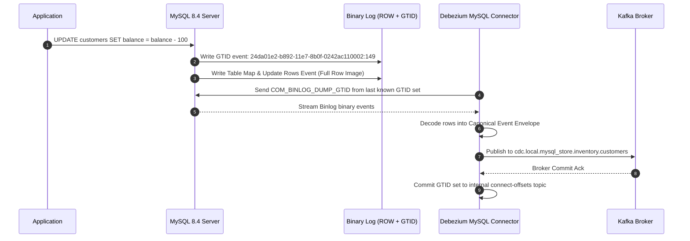

---

### 3.3 Oracle CDC Data Flow

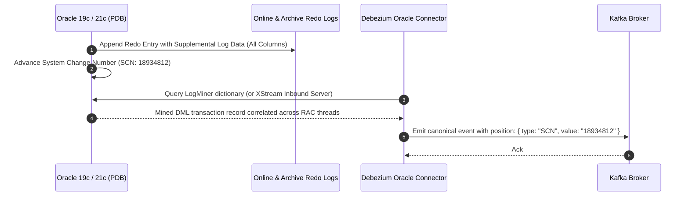

---

### 3.4 SQL Server CDC Data Flow

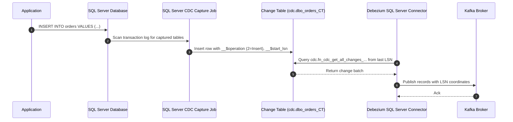

---

### 3.5 MongoDB CDC Data Flow

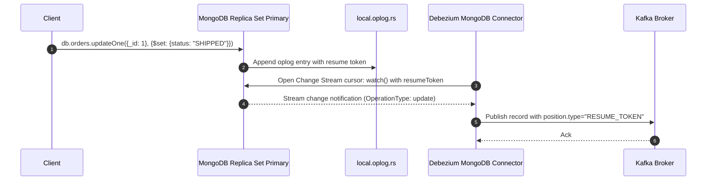

---

### 3.6 MariaDB CDC Data Flow (GTID Strict Mode)

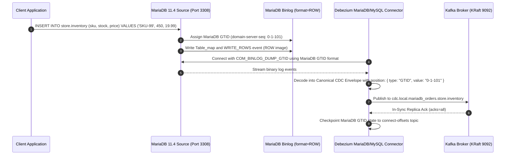

---

## 4. Incremental Snapshot Architecture (DBlog Algorithm)

Large enterprise tables cannot be snapshotted with exclusive or shared table locks without causing downtime. The platform implements the **DBlog watermark signaling algorithm**:

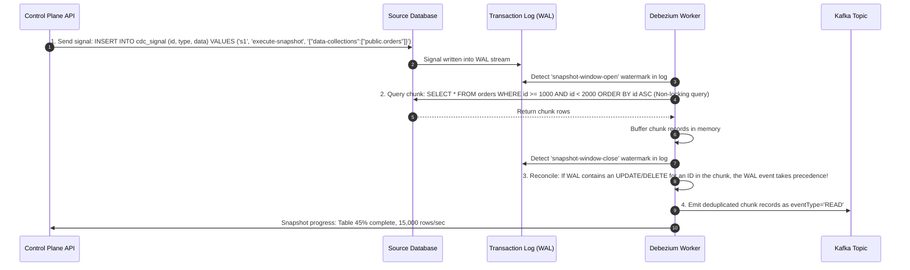

---

## 5. Kafka Topic Strategy & Schema Governance

### Topic Naming Structure
$$\mathbf{cdc}.\langle\text{env}\rangle.\langle\text{system}\rangle.\langle\text{database}\rangle.\langle\text{schema}\rangle.\langle\text{table}\rangle$$
* Example: `cdc.prod.ecommerce.orders_db.public.orders`

### Partitioning & Compaction
* **Partition Key:** Source primary key (e.g. `order_id`), guaranteeing **strict in-order processing** per record.
* **Cleanup Policy:** `compact,delete`
  * Log compaction guarantees the latest record state is never purged.
  * Time-based retention (e.g. 7 days) preserves the audit history of intermediate mutations.
* **Schema Evolution:** Enforces `BACKWARD` compatibility via Schema Registry. Incompatible DDL changes (e.g., dropping non-nullable columns) trigger automatic quarantine into a Dead Letter Queue (`cdc.dlq.*`).

---

## 6. Canonical Event Contract

Every change event emitted across any database source is normalized into a strict canonical envelope:

```json
{
  "$schema": "https://json-schema.org/draft/2020-12/schema",
  "eventId": "evt_01J8F3K9M7Q8R4STVWXYZ01234",
  "eventType": "UPDATE",
  "source": {
    "type": "postgres",
    "cluster": "prod-useast1-db-cluster",
    "database": "ecommerce_platform",
    "schema": "public",
    "table": "orders"
  },
  "transaction": {
    "id": "tx_94810294",
    "timestamp": "2026-09-25T09:48:11.234Z",
    "order": 1
  },
  "position": {
    "type": "LSN",
    "value": "0/16B2D88"
  },
  "key": {
    "order_id": "ord_8849102"
  },
  "before": {
    "order_id": "ord_8849102",
    "customer_id": "cust_1029",
    "status": "PENDING",
    "amount_cents": 14999
  },
  "after": {
    "order_id": "ord_8849102",
    "customer_id": "cust_1029",
    "status": "CONFIRMED",
    "amount_cents": 14999
  },
  "metadata": {
    "connector": "debezium-pg-orders",
    "snapshot": false,
    "sourceTimestamp": "2026-09-25T09:48:11.234Z",
    "captureTimestamp": "2026-09-25T09:48:11.298Z",
    "schemaVersion": "2.1.0",
    "schemaId": 42
  }
}
```

---

## 7. Failure Recovery & Resiliency Flows

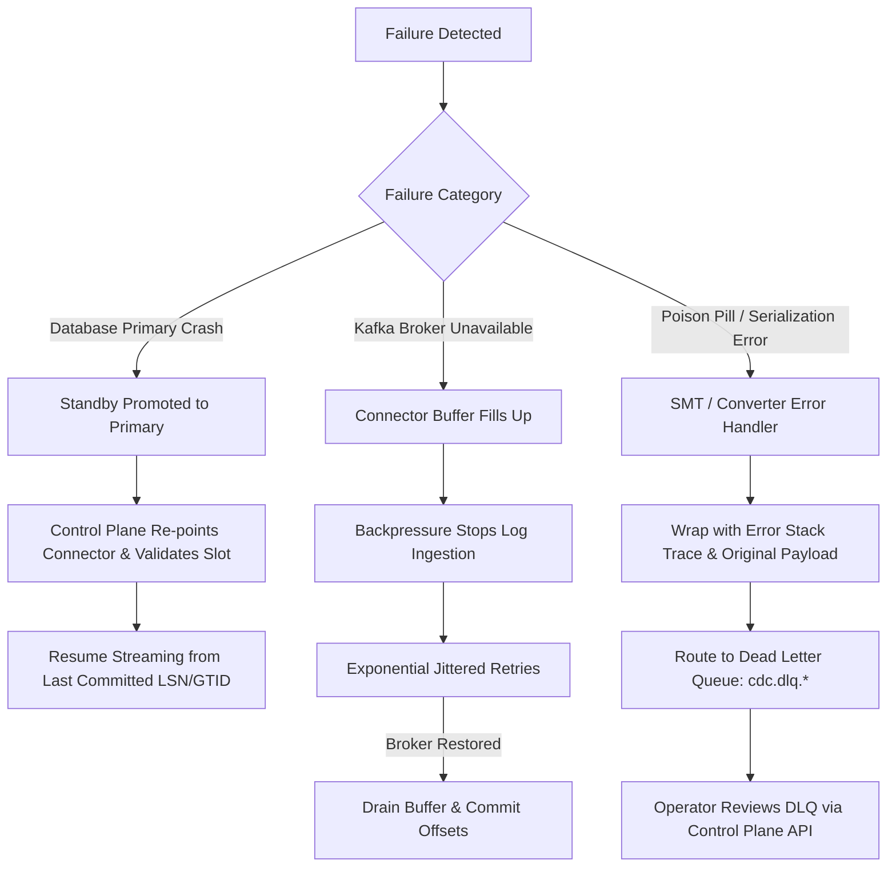

---

## 8. Security & RBAC Architecture

1. **Role-Based Access Control (RBAC):**
   * `PlatformAdmin`: Full administrative control, connector provisioning, and quota configuration.
   * `CDCOperator`: Pause/resume connectors, trigger incremental snapshots, and replay DLQ events.
   * `Developer`: Read schemas, inspect lag metrics, and query discovered catalogs.
   * `Auditor`: Immutable audit log inspector.
2. **In-Flight Data Masking:** Single Message Transforms (SMTs) evaluate hashing/redaction rules on the connector worker before events reach the Kafka broker network.
3. **Transport Security:** TLS 1.3 enforced on all external endpoints; SASL/SCRAM-SHA-512 authentication on Kafka broker listeners.

---

## 9. Non-Functional Requirements (NFR) Matrix

| Category | NFR Metric | Architectural Guarantee |
| :--- | :--- | :--- |
| **Availability** | $\ge 99.9\%$ | Distributed Kafka Connect task rebalancing with automatic failover. |
| **End-to-End Latency** | P95 $< 3$ seconds, P99 $< 15$ seconds | In-memory log decoding without intermediate disk spooling. |
| **Throughput** | $25,000+$ events/sec per worker | Optimized batch sizes (2048 records) and linger time (10ms). |
| **Data Loss Guarantee** | Zero unacknowledged data loss | `acks=all`, persistent replication slots, and idempotent Kafka producers. |
| **Host Memory Budget** | Strict $\le 11.5$ GB container ceiling | Explicit `mem_limit` and JVM heap caps tuned for Apple Silicon M2 16 GB. |
